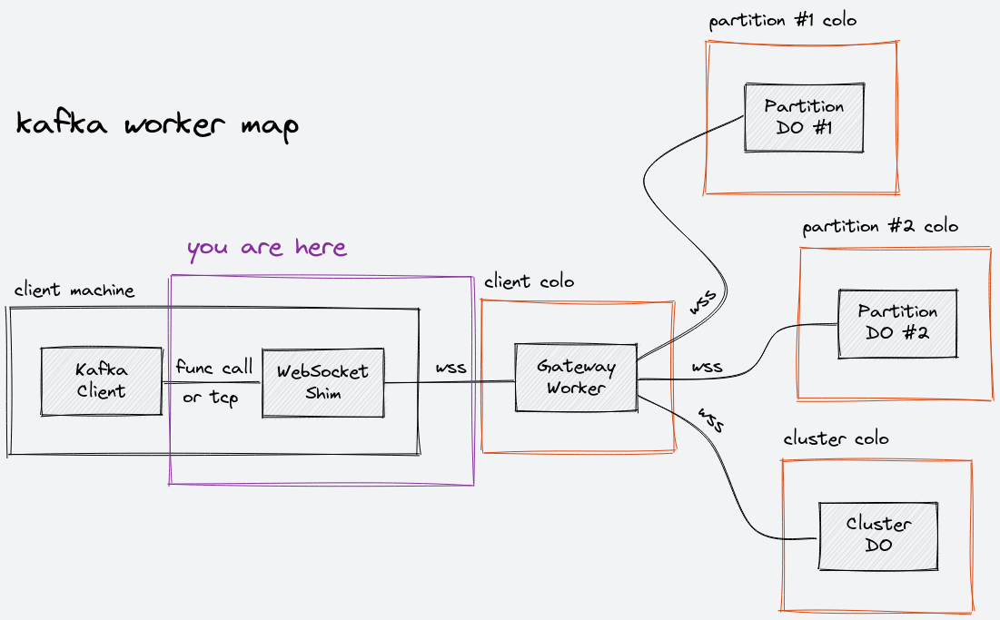

# Kafka WebSocket Shim

**Note:** This is a child project of [`kafka-worker`](https://github.com/maxwellpeterson/kafka-worker)

A shim layer that enables existing Kafka clients to connect to a broker implementation running on Cloudflare Workers with minimal configuration changes.

This project includes a Go package that provides a `net.Conn` implementation that frames Kafka protocol messages into WebSocket messages, plus a `proxy.Dialer` and `proxy.ContextDialer` implementation for creating these connections. It also includes a standalone TCP proxy that provides the same functionality, and can be used with Kafka clients written in other languages.

## Quick Start

### Go Package

```shell
go get github.com/maxwellpeterson/kafka-websocket-shim/pkg/shim
```

### TCP Proxy (From Source)

This method requires a local installation of Go.

```shell
git clone https://github.com/maxwellpeterson/kafka-websocket-shim.git
cd kafka-websocket-shim
go run cmd/kafka-websocket-proxy/main.go
```

### TCP Proxy (`go install`)

This method requires a local installation of Go, and assumes that `GOPATH/bin` is part of `PATH`.

```shell
go install github.com/maxwellpeterson/kafka-websocket-shim/cmd/kafka-websocket-proxy
kafka-websocket-proxy
```

### TCP Proxy (Docker)

This method requires a local installation of Docker.

```
docker run --rm --publish 8080:8080 ghcr.io/maxwellpeterson/kafka-websocket-proxy:main -broker=mybroker.workers.dev:443 -tls
```

To connect to a local instance of `kafka-worker`, it is recommended to run `kafka-worker` in a container and create a shared network for the proxy and broker. Using Docker Compose makes this setup easy, see [`kafka-worker-demo`](https://github.com/maxwellpeterson/kafka-worker-demo) for examples.

## Map


